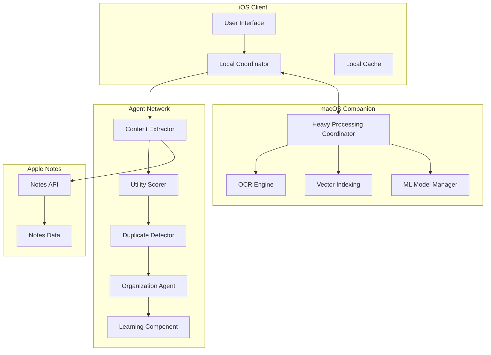
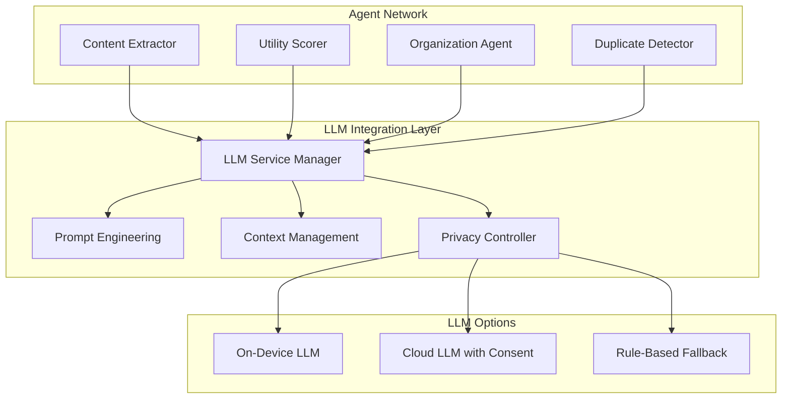
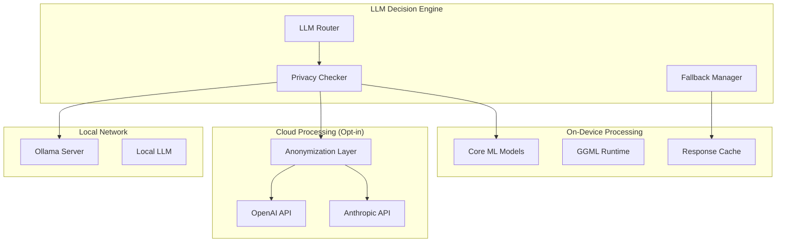

# Design Document

## Overview

The Notes AI Organizer is a sophisticated multi-agent AI system designed to intelligently analyze and organize Apple Notes libraries. The system employs a distributed architecture with specialized AI agents working collaboratively to provide comprehensive note analysis, utility scoring, duplicate detection, and organization recommendations.

The system prioritizes user privacy through on-device processing, maintains full user control through reversible operations, and provides a seamless mobile-first experience. The architecture supports both iOS and macOS platforms with intelligent workload distribution based on computational requirements.

## Architecture

The system follows a multi-agent architecture pattern with clear separation of concerns:



### Key Architectural Principles

1. **Privacy-First Design**: All processing occurs on-device by default
2. **Agent Specialization**: Each agent has a specific, well-defined responsibility
3. **Graceful Degradation**: System continues operating even if some agents fail
4. **Reversible Operations**: All actions can be undone completely
5. **Resource Awareness**: Intelligent workload distribution based on device capabilities## Compone
nts and Interfaces

### iOS Client Components

#### User Interface Layer
- **Dashboard**: Main interface showing processing status, recommendation counts, and quick actions
- **Recommendation Cards**: Mobile-optimized cards displaying note previews, scores, and actions
- **Detail Views**: Expandable views showing full note content and AI analysis
- **Batch Action Interface**: Controls for approving/rejecting multiple recommendations
- **Settings & Permissions**: Privacy controls and system configuration

#### Local Coordinator
- **Agent Orchestration**: Manages communication between specialized agents
- **Resource Management**: Monitors device resources and throttles processing
- **State Management**: Maintains processing state and handles interruptions
- **Sync Coordination**: Manages communication with macOS Companion

### Agent Network Components

#### Content Extractor Agent
- **Text Processing**: Extracts and normalizes text content from notes
- **OCR Integration**: Coordinates with macOS OCR engine for handwriting recognition
- **Image Analysis**: Extracts metadata and content from embedded images
- **Attachment Processing**: Identifies and processes various attachment types
- **Checklist Parser**: Preserves structure and completion status of checklists

#### Utility Scorer Agent
- **Content Analysis**: Applies TF-IDF and keyword importance weighting
- **Behavioral Scoring**: Analyzes access patterns, modification recency, sharing history
- **Semantic Analysis**: Uses embeddings to understand content meaning and relevance
- **Rule-Based Classification**: Implements date-based aging and content length thresholds
- **Hybrid Scoring**: Combines multiple algorithms with learned user preferences

#### Duplicate Detector Agent
- **Embedding Generation**: Creates semantic embeddings for similarity comparison
- **Similarity Search**: Uses FAISS indexing for efficient duplicate detection
- **Content Comparison**: Identifies exact, near-duplicate, and overlapping content
- **Ranking Algorithm**: Scores versions by completeness, recency, and quality
- **Merge Strategy**: Determines optimal content combination approaches

#### Organization Agent
- **Title Analysis**: Identifies generic titles and content-title mismatches
- **Theme Extraction**: Analyzes content to identify key topics and themes
- **Folder Suggestions**: Recommends logical groupings and folder structures
- **Recommendation Generation**: Creates actionable organization suggestions
- **Batch Optimization**: Identifies opportunities for bulk organizational improvements

#### Learning Component
- **Feedback Collection**: Records user acceptance/rejection patterns with context
- **Preference Learning**: Identifies patterns in user decision-making
- **Algorithm Adaptation**: Adjusts scoring thresholds and recommendation criteria
- **Privacy-Preserving Learning**: Maintains user privacy while improving accuracy### macOS
 Companion Components

#### Heavy Processing Coordinator
- **Workload Distribution**: Manages computationally intensive tasks
- **Resource Optimization**: Utilizes macOS processing power efficiently
- **Progress Reporting**: Provides real-time updates to iOS Client
- **Secure Communication**: Maintains encrypted local network protocols

#### OCR Engine
- **Handwriting Recognition**: Converts handwritten text to searchable content
- **Image Text Extraction**: Processes text within embedded images
- **Quality Assessment**: Evaluates OCR confidence and accuracy
- **Fallback Handling**: Manages OCR failures gracefully

#### Vector Indexing System
- **FAISS Integration**: Manages IndexFlatIP for exact search (up to 100K notes)
- **Scalable Indexing**: Uses IndexIVFFlat for larger collections
- **Embedding Storage**: Efficient storage and retrieval of note embeddings
- **Index Maintenance**: Handles pruning and updates of vector indices

#### ML Model Manager
- **Model Loading**: Manages MobileBERT (25MB) and classification models (15MB)
- **Inference Coordination**: Distributes ML tasks across available resources
- **Model Updates**: Handles background model updates and validation
- **Fallback Systems**: Provides rule-based alternatives when ML fails

### Apple Notes Integration

#### API Integration Layer
- **EventKit Framework**: iOS-native access to Notes data
- **NSAppleScript Bridge**: Enhanced macOS access capabilities
- **Permission Management**: Handles access permissions and revocation detection
- **Rate Limiting**: Implements respectful API usage (max 100 notes/second)
- **Change Monitoring**: Uses FSEvents on macOS for real-time updates

## Data Models

### Core Data Structures

#### Note Model
```typescript
interface Note {
  id: string;
  title: string;
  content: string;
  createdDate: Date;
  modifiedDate: Date;
  folder: string;
  attachments: Attachment[];
  checklists: ChecklistItem[];
  metadata: NoteMetadata;
}
```

#### Utility Score Model
```typescript
interface UtilityScore {
  noteId: string;
  overallScore: number; // 0-100
  contentScore: number;
  behavioralScore: number;
  semanticScore: number;
  ruleBasedScore: number;
  explanation: string;
  confidence: number;
  factors: ScoringFactor[];
}
```

#### Recommendation Model
```typescript
interface Recommendation {
  id: string;
  noteId: string;
  action: RecommendationAction;
  confidence: number;
  reasoning: string;
  impact: ImpactLevel;
  reversible: boolean;
  relatedNotes?: string[]; // For merge recommendations
  suggestedTitle?: string;
  suggestedFolder?: string;
}
```

#### Duplicate Group Model
```typescript
interface DuplicateGroup {
  id: string;
  noteIds: string[];
  similarityScores: number[];
  recommendedPrimary: string;
  mergeStrategy: MergeStrategy;
  conflictAreas: ConflictArea[];
}
```
#
## LLM Integration Layer

#### LLM Service Manager
- **Model Selection**: Manages multiple LLM options (on-device, cloud-based with consent)
- **Context Management**: Handles prompt engineering and context window optimization
- **Privacy Controls**: Ensures user consent for any cloud-based LLM usage
- **Fallback Strategy**: Provides degraded functionality when LLM is unavailable
- **Response Processing**: Parses and validates LLM outputs for system use

#### LLM-Powered Capabilities

**Content Understanding**
- **Semantic Analysis**: Uses LLM to understand note content meaning and context
- **Topic Extraction**: Identifies key themes and subjects within notes
- **Intent Recognition**: Determines the purpose and type of each note
- **Content Summarization**: Generates concise summaries for long notes

**Intelligent Recommendations**
- **Explanation Generation**: Creates human-readable explanations for AI decisions
- **Title Suggestions**: Generates descriptive, contextual titles based on content
- **Organization Insights**: Provides reasoning for folder and grouping suggestions
- **Merge Recommendations**: Analyzes content overlap and suggests merge strategies

**Natural Language Processing**
- **Content Classification**: Categorizes notes by type (meeting notes, ideas, tasks, etc.)
- **Sentiment Analysis**: Understands emotional context and importance indicators
- **Relationship Detection**: Identifies connections between different notes
- **Quality Assessment**: Evaluates note completeness and usefulness

#### LLM Architecture Integration



#### LLM Data Models

```typescript
interface LLMRequest {
  agentId: string;
  requestType: LLMRequestType;
  context: string;
  noteContent: string;
  systemPrompt: string;
  userPrompt: string;
  maxTokens: number;
  temperature: number;
}

interface LLMResponse {
  requestId: string;
  response: string;
  confidence: number;
  tokensUsed: number;
  processingTime: number;
  model: string;
  fallbackUsed: boolean;
}

enum LLMRequestType {
  CONTENT_ANALYSIS = "content_analysis",
  TITLE_GENERATION = "title_generation", 
  EXPLANATION = "explanation",
  CLASSIFICATION = "classification",
  SUMMARIZATION = "summarization",
  RELATIONSHIP_DETECTION = "relationship_detection"
}
```#
# LLM Integration Strategy

### Integration Approaches

#### Option 1: On-Device LLM (Recommended Primary)
**Implementation:**
- Use Apple's Core ML framework with quantized models (e.g., Llama 3.2 3B, Phi-3 Mini)
- Deploy models optimized for iOS/macOS (GGML format, 4-bit quantization)
- Leverage Apple Neural Engine for efficient inference

**Advantages:**
- Complete privacy - no data leaves device
- No network dependency
- Consistent performance
- No API costs

**Limitations:**
- Model size constraints (2-4GB realistic limit)
- Reduced capability vs. larger models
- Device performance impact

#### Option 2: Hybrid Approach (Privacy-Conscious Cloud)
**Implementation:**
- Primary: On-device LLM for basic tasks
- Secondary: Cloud LLM with explicit user consent for complex analysis
- Use differential privacy techniques for cloud requests
- Implement request anonymization and data minimization

**Cloud Integration Options:**
- OpenAI GPT-4o mini (cost-effective, good performance)
- Anthropic Claude Haiku (privacy-focused, efficient)
- Local deployment of Llama models via Ollama
- Apple Intelligence APIs (when available)

#### Option 3: Edge Computing
**Implementation:**
- Deploy LLM on user's local network (Mac Studio, Mac Pro)
- iOS app communicates with local LLM server
- Maintains privacy while accessing larger models

### Recommended Architecture



### Task-Specific LLM Usage

#### Content Extractor Agent + LLM
```typescript
// Example: Understanding note content and context
const analyzeNoteContent = async (note: Note): Promise<ContentAnalysis> => {
  const prompt = `Analyze this note and identify:
1. Primary topic/theme
2. Note type (meeting, idea, task, reference, etc.)
3. Key entities (people, dates, locations)
4. Importance indicators
5. Actionable items

Note content: "${note.content}"`;

  return await llmService.request({
    type: LLMRequestType.CONTENT_ANALYSIS,
    prompt,
    maxTokens: 500,
    preferOnDevice: true
  });
};
```

#### Utility Scorer Agent + LLM
```typescript
// Example: Generating explanations for utility scores
const explainUtilityScore = async (note: Note, score: UtilityScore): Promise<string> => {
  const prompt = `Explain why this note received a utility score of ${score.overallScore}/100:

Note: "${note.title}" - "${note.content.substring(0, 200)}..."
Factors: Content relevance (${score.contentScore}), Usage patterns (${score.behavioralScore}), Semantic value (${score.semanticScore})

Provide a clear, non-technical explanation in 2-3 sentences.`;

  const response = await llmService.request({
    type: LLMRequestType.EXPLANATION,
    prompt,
    maxTokens: 150,
    preferOnDevice: true
  });
  
  return response.content;
};
```

#### Organization Agent + LLM
```typescript
// Example: Generating better titles
const suggestTitle = async (note: Note): Promise<string> => {
  const prompt = `Generate a descriptive, searchable title for this note content:

"${note.content.substring(0, 500)}..."

Current title: "${note.title}"

Requirements:
- 3-8 words
- Descriptive and specific
- Searchable keywords
- Professional tone

Title:`;

  const response = await llmService.request({
    type: LLMRequestType.TITLE_GENERATION,
    prompt,
    maxTokens: 20,
    preferOnDevice: true
  });
  
  return response.content.trim();
};
```

### Privacy-First Implementation

#### Data Minimization
```typescript
interface PrivacyConfig {
  maxContentLength: number; // Limit content sent to LLM
  anonymizePersonalInfo: boolean; // Remove names, emails, etc.
  useOnDeviceFirst: boolean; // Prefer on-device processing
  requireExplicitConsent: boolean; // For cloud LLM usage
  retentionPolicy: 'none' | 'session' | 'encrypted'; // Data retention
}

const processWithPrivacy = async (content: string, config: PrivacyConfig) => {
  // 1. Truncate content if needed
  const truncated = content.substring(0, config.maxContentLength);
  
  // 2. Anonymize if required
  const anonymized = config.anonymizePersonalInfo 
    ? anonymizeContent(truncated) 
    : truncated;
  
  // 3. Try on-device first
  if (config.useOnDeviceFirst) {
    try {
      return await onDeviceLLM.process(anonymized);
    } catch (error) {
      // Fall back to cloud with consent
      if (config.requireExplicitConsent) {
        const consent = await requestUserConsent();
        if (!consent) throw new Error('User declined cloud processing');
      }
      return await cloudLLM.process(anonymized);
    }
  }
};
```

### Performance Optimization

#### Intelligent Caching
- Cache LLM responses for similar content
- Use semantic similarity to find cached responses
- Implement cache invalidation based on user feedback

#### Batch Processing
- Group similar LLM requests together
- Process multiple notes in single LLM call when possible
- Prioritize high-impact requests first

#### Resource Management
- Monitor device temperature and battery
- Throttle LLM usage during low battery
- Pause processing during active user interaction

Would you like me to elaborate on any specific aspect of this LLM integration approach? I'm particularly interested in your thoughts on the privacy vs. capability trade-offs and which integration option you think would work best for your use case.## 
Error Handling

### Graceful Degradation Strategy

#### LLM Failure Handling
- **On-Device Model Failure**: Fall back to rule-based classification and simpler heuristics
- **Cloud LLM Timeout**: Use cached responses or simplified analysis
- **Network Issues**: Continue with on-device processing only
- **Model Loading Errors**: Provide basic functionality without advanced AI features

#### Agent Failure Recovery
- **Content Extractor Failure**: Skip problematic notes, continue with others
- **Utility Scorer Failure**: Use simplified scoring based on basic metrics
- **Duplicate Detector Failure**: Disable duplicate detection, continue other functions
- **Organization Agent Failure**: Provide basic recommendations without LLM enhancement

#### Data Integrity Protection
- **Backup Creation**: Automatic backups before any bulk operations
- **Transaction Logging**: Detailed logs for all note modifications
- **Rollback Capability**: Complete restoration of previous states
- **Corruption Detection**: Validate data integrity throughout processing

### Error Recovery Patterns

```typescript
interface ErrorRecoveryStrategy {
  maxRetries: number;
  backoffMultiplier: number;
  fallbackAction: FallbackAction;
  userNotification: boolean;
  logLevel: LogLevel;
}

const processWithRecovery = async <T>(
  operation: () => Promise<T>,
  strategy: ErrorRecoveryStrategy
): Promise<T> => {
  let attempts = 0;
  let lastError: Error;
  
  while (attempts < strategy.maxRetries) {
    try {
      return await operation();
    } catch (error) {
      lastError = error;
      attempts++;
      
      if (attempts < strategy.maxRetries) {
        const delay = Math.pow(strategy.backoffMultiplier, attempts) * 1000;
        await new Promise(resolve => setTimeout(resolve, delay));
      }
    }
  }
  
  // Execute fallback action
  return await executeFallback(strategy.fallbackAction, lastError);
};
```

## Testing Strategy

*A property is a characteristic or behavior that should hold true across all valid executions of a system-essentially, a formal statement about what the system should do. Properties serve as the bridge between human-readable specifications and machine-verifiable correctness guarantees.*

The testing approach combines comprehensive unit testing with property-based testing to ensure system reliability and correctness across all scenarios.###
 Property-Based Testing Framework

The system will use **fast-check** (JavaScript/TypeScript) for property-based testing, configured to run a minimum of 100 iterations per property to ensure comprehensive coverage of the input space.

Each property-based test will be tagged with comments explicitly referencing the correctness property using the format: **Feature: notes-ai-organizer, Property {number}: {property_text}**

### Unit Testing Approach

Unit tests will focus on:
- Specific examples demonstrating correct behavior
- Edge cases and boundary conditions  
- Integration points between agents
- Error conditions and recovery scenarios
- API integration with Apple Notes

Unit tests complement property-based tests by catching concrete bugs while properties verify general correctness across all inputs.

## Correctness Properties

Property 1: Permission revocation stops processing
*For any* system state, when a user revokes permission, all processing should immediately stop and cached data should be deleted
**Validates: Requirements 1.4**

Property 2: Permission management availability
*For any* system configuration where permission management exists, users should be able to modify access permissions at any time
**Validates: Requirements 1.5**

Property 3: OCR processing for handwritten content
*For any* note containing handwritten text, the Content_Extractor should apply OCR to convert it to searchable text
**Validates: Requirements 2.1**

Property 4: Image content analysis
*For any* note containing images, the Content_Extractor should analyze image content and extract relevant metadata
**Validates: Requirements 2.2**

Property 5: Attachment processing
*For any* note containing attachments, the Content_Extractor should identify attachment types and extract accessible content
**Validates: Requirements 2.3**

Property 6: Checklist structure preservation
*For any* note containing checklists, the Content_Extractor should preserve checklist structure and completion status
**Validates: Requirements 2.4**

Property 7: Extraction failure resilience
*For any* content extraction failure, the system should log the failure and continue processing other elements
**Validates: Requirements 2.5**

Property 8: Valid utility score assignment
*For any* note processed by the Utility_Scorer, a utility score between 0 and 100 should be assigned using the specified algorithms
**Validates: Requirements 3.1**

Property 9: Valid recommendation generation
*For any* scored note processed by the Organization_Agent, one of the six valid recommendation actions should be generated
**Validates: Requirements 3.2**

Property 10: Explanation provision
*For any* completed utility scoring operation, a human-readable explanation should be provided including classification factors
**Validates: Requirements 3.3**

Property 11: Duplicate detection for similar content
*For any* set of notes with similar content, the Duplicate_Detector should identify them as merge candidates using embedding similarity
**Validates: Requirements 3.4**

Property 12: Title suggestion for unclear titles
*For any* note with unclear or generic titles, the Organization_Agent should suggest improved titles based on content analysis
**Validates: Requirements 3.5**

Property 13: On-device processing boundary
*For any* note processing operation by the Agent_Network, all analysis should execute on-device within the Privacy_Boundary
**Validates: Requirements 4.1**

Property 14: Heavy processing delegation
*For any* computationally intensive task, the macOS_Companion should handle the processing locally
**Validates: Requirements 4.2**

Property 15: Privacy-preserving coordination
*For any* coordination between iOS_Client and macOS_Companion, privacy should be maintained throughout the process
**Validates: Requirements 4.3**

Property 16: Offline operation capability
*For any* system operation when network connectivity is unavailable, the system should continue operating with full functionality
**Validates: Requirements 4.4**

Property 17: Cloud processing consent requirement
*For any* cloud processing option, explicit user consent should be required before any off-device processing
**Validates: Requirements 4.5**

Property 18: Original note preservation in recommendations
*For any* recommendation display, note content copies should be presented without modifying original notes
**Validates: Requirements 5.1**

Property 19: Complete recommendation review interface
*For any* recommendation review, the interface should display copied note content alongside AI analysis and proposed action
**Validates: Requirements 5.2**

Property 20: Deletion confirmation
*For any* approved deletion recommendation, the original note should be deleted from Apple Notes with confirmation provided
**Validates: Requirements 5.3**

Property 21: Rejection feedback recording
*For any* rejected recommendation, feedback should be recorded for learning purposes and the original note should remain unchanged
**Validates: Requirements 5.4**

Property 22: High-impact recommendation prioritization
*For any* interface load, high-impact recommendations should be displayed first with clear approve/reject options
**Validates: Requirements 5.5**

Property 23: Reversible operation recording
*For any* executed Recommendation_Action, a reversible operation record should be created
**Validates: Requirements 6.1**

Property 24: Complete state restoration
*For any* undo request, the system should restore the previous state completely
**Validates: Requirements 6.2**

Property 25: Recommendation explanation provision
*For any* displayed recommendation, clear explanations should be provided for each suggested action
**Validates: Requirements 6.3**

Property 26: Irreversible action warnings
*For any* action that cannot be reversed, the system should warn the user before execution
**Validates: Requirements 6.4**

Property 27: Action logging when history available
*For any* executed action where action history is available, a log should be maintained for potential reversal
**Validates: Requirements 6.5**

Property 28: Feedback recording with context
*For any* user acceptance or rejection of recommendations, the Learning_Component should record the feedback with context
**Validates: Requirements 7.1**

Property 29: Threshold adjustment with sufficient feedback
*For any* scenario where sufficient feedback is collected, the Learning_Component should adjust utility scoring thresholds
**Validates: Requirements 7.2**

Property 30: Algorithm modification based on patterns
*For any* detected patterns in user preferences, the Learning_Component should modify recommendation algorithms accordingly
**Validates: Requirements 7.3**

Property 31: Updated criteria application
*For any* learned new preferences, the system should apply updated criteria to future analysis
**Validates: Requirements 7.4**

Property 32: Privacy-preserving learning
*For any* learning operation where learning data exists, user privacy should be preserved while improving recommendations
**Validates: Requirements 7.5**#
# Agent-Specific LLM Integration Requirements

### Agent Architecture with LLM Integration

Each specialized agent requires specific LLM capabilities to fulfill its responsibilities:

#### Content Extractor Agent LLM Integration
**Required LLM Capabilities:**
- **Content Understanding**: Interpret mixed content (text, handwriting OCR results, image descriptions)
- **Semantic Parsing**: Extract meaning from unstructured note content
- **Entity Recognition**: Identify people, dates, locations, tasks, and key concepts
- **Content Classification**: Categorize content type (meeting notes, ideas, tasks, references)

**Integration Pattern:**
```typescript
class ContentExtractorAgent {
  private llmService: LLMService;
  
  async extractContent(note: Note): Promise<ExtractedContent> {
    // 1. Get raw content from all sources
    const rawContent = await this.getRawContent(note);
    
    // 2. Use LLM to understand and structure content
    const analysis = await this.llmService.analyze({
      prompt: `Extract structured information from this note:
        Content: ${rawContent}
        
        Identify:
        - Main topics and themes
        - Key entities (people, dates, locations)
        - Action items or tasks
        - Content type (meeting, idea, task, reference)
        - Importance indicators`,
      model: 'on-device-preferred'
    });
    
    return this.parseAnalysis(analysis);
  }
}
```

#### Utility Scorer Agent LLM Integration
**Required LLM Capabilities:**
- **Content Quality Assessment**: Evaluate completeness, clarity, and usefulness
- **Contextual Relevance**: Determine current relevance and future value
- **Semantic Importance**: Understand content significance beyond keywords
- **Explanation Generation**: Create human-readable scoring rationales

**Integration Pattern:**
```typescript
class UtilityScorerAgent {
  async scoreUtility(note: Note, extractedContent: ExtractedContent): Promise<UtilityScore> {
    // Combine traditional metrics with LLM assessment
    const traditionalScore = this.calculateTraditionalMetrics(note);
    
    const llmAssessment = await this.llmService.assess({
      prompt: `Rate the utility of this note content (0-100):
        
        Content: ${extractedContent.summary}
        Type: ${extractedContent.type}
        Last Modified: ${note.modifiedDate}
        
        Consider:
        - Information completeness and clarity
        - Current relevance and future value
        - Uniqueness vs redundancy
        - Actionability of content
        
        Provide score and brief reasoning.`,
      model: 'on-device-preferred'
    });
    
    return this.combineScores(traditionalScore, llmAssessment);
  }
}
```

#### Duplicate Detector Agent LLM Integration
**Required LLM Capabilities:**
- **Semantic Similarity**: Understand content similarity beyond text matching
- **Content Comparison**: Identify which version is more complete/valuable
- **Merge Strategy**: Determine how to combine duplicate content optimally
- **Conflict Resolution**: Handle contradictory information between duplicates

**Integration Pattern:**
```typescript
class DuplicateDetectorAgent {
  async detectDuplicates(notes: Note[]): Promise<DuplicateGroup[]> {
    // 1. Use embeddings for initial similarity detection
    const similarPairs = await this.findSimilarPairs(notes);
    
    // 2. Use LLM for semantic comparison
    const duplicateGroups = [];
    for (const pair of similarPairs) {
      const comparison = await this.llmService.compare({
        prompt: `Compare these two notes for duplication:
          
          Note 1: "${pair.note1.content}"
          Note 2: "${pair.note2.content}"
          
          Determine:
          - Are they duplicates? (exact/near-duplicate/different)
          - Which is more complete/valuable?
          - How should they be merged?
          - What conflicts exist?`,
        model: 'on-device-preferred'
      });
      
      if (comparison.isDuplicate) {
        duplicateGroups.push(this.createDuplicateGroup(pair, comparison));
      }
    }
    
    return duplicateGroups;
  }
}
```

#### Organization Agent LLM Integration
**Required LLM Capabilities:**
- **Title Generation**: Create descriptive, searchable titles from content
- **Categorization**: Suggest logical folder structures and groupings
- **Content Summarization**: Generate concise summaries for long notes
- **Relationship Detection**: Identify connections between different notes

**Integration Pattern:**
```typescript
class OrganizationAgent {
  async generateRecommendations(note: Note, utilityScore: UtilityScore): Promise<Recommendation[]> {
    const recommendations = [];
    
    // Title improvement
    if (this.needsTitleImprovement(note)) {
      const titleSuggestion = await this.llmService.generateTitle({
        prompt: `Generate a descriptive title (3-8 words) for this note:
          
          Current title: "${note.title}"
          Content: "${note.content.substring(0, 300)}..."
          
          Make it specific, searchable, and professional.`,
        model: 'on-device-preferred'
      });
      
      recommendations.push({
        type: 'rename',
        suggestedTitle: titleSuggestion.title,
        reasoning: titleSuggestion.reasoning
      });
    }
    
    // Organization suggestions
    const orgSuggestion = await this.llmService.categorize({
      prompt: `Suggest organization for this note:
        
        Content: "${note.content.substring(0, 500)}..."
        Current folder: "${note.folder}"
        
        Suggest:
        - Best folder/category
        - Related note topics
        - Organization reasoning`,
      model: 'on-device-preferred'
    });
    
    recommendations.push(...this.createOrgRecommendations(orgSuggestion));
    
    return recommendations;
  }
}
```

#### Learning Component LLM Integration
**Required LLM Capabilities:**
- **Pattern Recognition**: Identify patterns in user feedback and preferences
- **Preference Modeling**: Understand user decision-making criteria
- **Algorithm Adaptation**: Adjust scoring and recommendation logic based on learning
- **Explanation Improvement**: Refine explanations based on user responses

**Integration Pattern:**
```typescript
class LearningComponent {
  async adaptFromFeedback(feedback: UserFeedback[]): Promise<AdaptationResult> {
    const patterns = await this.llmService.analyzePatterns({
      prompt: `Analyze user feedback patterns:
        
        Feedback data: ${JSON.stringify(feedback.slice(-50))}
        
        Identify:
        - What types of notes does user prefer to keep/delete?
        - What factors influence their decisions?
        - How should scoring weights be adjusted?
        - What explanation styles work best?`,
      model: 'cloud-with-anonymization' // More complex analysis
    });
    
    return this.implementAdaptations(patterns);
  }
}
```

### Agent Coordination with LLM

The agents need to coordinate their LLM usage to:

1. **Share Context**: Pass LLM insights between agents to avoid redundant analysis
2. **Manage Resources**: Coordinate LLM requests to avoid overwhelming the system
3. **Maintain Consistency**: Ensure LLM responses are consistent across agents
4. **Handle Failures**: Provide fallbacks when LLM services are unavailable

```typescript
class AgentCoordinator {
  private llmContextCache: Map<string, LLMContext> = new Map();
  
  async coordinateAgentProcessing(note: Note): Promise<ProcessingResult> {
    // 1. Content Extractor runs first, creates LLM context
    const extractedContent = await this.contentExtractor.process(note);
    this.llmContextCache.set(note.id, extractedContent.llmContext);
    
    // 2. Other agents reuse LLM context to avoid redundant analysis
    const utilityScore = await this.utilityScorer.process(note, extractedContent);
    const duplicateInfo = await this.duplicateDetector.process(note, extractedContent);
    const recommendations = await this.organizationAgent.process(note, utilityScore);
    
    // 3. Learning component observes all LLM interactions
    await this.learningComponent.observeProcessing({
      note,
      extractedContent,
      utilityScore,
      recommendations
    });
    
    return { extractedContent, utilityScore, duplicateInfo, recommendations };
  }
}
```

**Key Integration Requirements:**
1. **Shared LLM Service**: All agents use a common LLM service with consistent APIs
2. **Context Sharing**: Agents share LLM analysis results to avoid redundant processing
3. **Resource Management**: Coordinate LLM usage to respect rate limits and device resources
4. **Fallback Strategies**: Each agent has non-LLM fallbacks for core functionality
5. **Privacy Consistency**: All agents follow the same privacy rules for LLM usage

Does this clarify the specific agent-LLM integration requirements you were asking about?## Local 
LLM Integration Technical Implementation

### Option 1: Core ML Integration (iOS/macOS Native)

**Technical Approach:**
```typescript
// Using Apple's Core ML framework for on-device inference
import { CoreMLModel } from '@react-native-ml-kit/core-ml';

class LocalLLMService {
  private model: CoreMLModel;
  
  async initialize() {
    // Load quantized model (e.g., Llama 3.2 3B in Core ML format)
    this.model = await CoreMLModel.loadModel({
      modelPath: 'llama-3.2-3b-coreml.mlpackage',
      computeUnits: 'cpuAndNeuralEngine' // Use Neural Engine when available
    });
  }
  
  async processAgentRequest(agentId: string, prompt: string): Promise<string> {
    const input = this.tokenizeInput(prompt);
    const output = await this.model.predict(input);
    return this.decodeOutput(output);
  }
}

// Agent integration
class ContentExtractorAgent {
  constructor(private llmService: LocalLLMService) {}
  
  async extractContent(note: Note): Promise<ExtractedContent> {
    const prompt = this.buildExtractionPrompt(note);
    const response = await this.llmService.processAgentRequest('content-extractor', prompt);
    return this.parseResponse(response);
  }
}
```

### Option 2: GGML/Llama.cpp Integration

**Technical Approach:**
```typescript
// Using GGML format models with llama.cpp bindings
import { LlamaCpp } from 'llama-node';

class GGMLLLMService {
  private llamaInstance: LlamaCpp;
  
  async initialize() {
    this.llamaInstance = new LlamaCpp({
      modelPath: './models/llama-3.2-3b-instruct-q4_0.gguf',
      contextSize: 4096,
      threads: 4, // Adjust based on device capabilities
      gpuLayers: 0 // CPU-only for privacy
    });
    
    await this.llamaInstance.load();
  }
  
  async processAgentRequest(agentId: string, prompt: string): Promise<string> {
    const response = await this.llamaInstance.createCompletion({
      prompt: prompt,
      maxTokens: 512,
      temperature: 0.1,
      stopSequence: ['\n\n', '###']
    });
    
    return response.choices[0].text;
  }
}
```

### Option 3: Ollama Local Server Integration

**Technical Approach:**
```typescript
// Using Ollama running locally on macOS
class OllamaLLMService {
  private baseUrl = 'http://localhost:11434';
  
  async initialize() {
    // Ensure Ollama is running with desired model
    await this.pullModel('llama3.2:3b');
  }
  
  async processAgentRequest(agentId: string, prompt: string): Promise<string> {
    const response = await fetch(`${this.baseUrl}/api/generate`, {
      method: 'POST',
      headers: { 'Content-Type': 'application/json' },
      body: JSON.stringify({
        model: 'llama3.2:3b',
        prompt: prompt,
        stream: false,
        options: {
          temperature: 0.1,
          top_p: 0.9,
          max_tokens: 512
        }
      })
    });
    
    const data = await response.json();
    return data.response;
  }
  
  private async pullModel(modelName: string) {
    await fetch(`${this.baseUrl}/api/pull`, {
      method: 'POST',
      body: JSON.stringify({ name: modelName })
    });
  }
}
```

### Option 4: WebAssembly (WASM) Integration

**Technical Approach:**
```typescript
// Using WebLLM or similar WASM-based LLM runtime
import { WebLLM } from '@mlc-ai/web-llm';

class WASMLLMService {
  private engine: WebLLM;
  
  async initialize() {
    this.engine = new WebLLM();
    await this.engine.reload('Llama-3.2-3B-Instruct-q4f16_1-MLC');
  }
  
  async processAgentRequest(agentId: string, prompt: string): Promise<string> {
    const response = await this.engine.chat.completions.create({
      messages: [{ role: 'user', content: prompt }],
      max_tokens: 512,
      temperature: 0.1
    });
    
    return response.choices[0].message.content;
  }
}
```

### Agent-Specific Local Integration Patterns

#### Content Extractor Agent Local Integration
```typescript
class ContentExtractorAgent {
  constructor(private localLLM: LocalLLMService) {}
  
  async extractFromNote(note: Note): Promise<ExtractedContent> {
    // Build specialized prompt for content extraction
    const systemPrompt = `You are a content extraction specialist. Extract structured information from notes.`;
    const userPrompt = `Extract key information from this note:
      
      Title: ${note.title}
      Content: ${note.content}
      
      Return JSON with:
      - topics: string[]
      - entities: {people: string[], dates: string[], locations: string[]}
      - type: "meeting" | "idea" | "task" | "reference" | "other"
      - actionItems: string[]
      - importance: number (1-10)`;
    
    // Local LLM call with structured output
    const response = await this.localLLM.processAgentRequest(
      'content-extractor',
      `${systemPrompt}\n\n${userPrompt}`
    );
    
    return JSON.parse(response);
  }
}
```

#### Utility Scorer Agent Local Integration
```typescript
class UtilityScorerAgent {
  async scoreWithLocalLLM(note: Note, extractedContent: ExtractedContent): Promise<UtilityScore> {
    const prompt = `Rate this note's utility (0-100) and explain why:
      
      Content Summary: ${extractedContent.summary}
      Type: ${extractedContent.type}
      Last Modified: ${note.modifiedDate}
      Access Count: ${note.accessCount}
      
      Consider: completeness, relevance, uniqueness, actionability
      
      Return JSON: {"score": number, "reasoning": string, "factors": string[]}`;
    
    const response = await this.localLLM.processAgentRequest('utility-scorer', prompt);
    const llmScore = JSON.parse(response);
    
    // Combine with traditional metrics
    return this.combineScores(llmScore, this.calculateTraditionalScore(note));
  }
}
```

### Local LLM Resource Management

```typescript
class LocalLLMResourceManager {
  private requestQueue: LLMRequest[] = [];
  private isProcessing = false;
  private maxConcurrentRequests = 1; // Prevent overwhelming device
  
  async queueRequest(agentId: string, prompt: string): Promise<string> {
    return new Promise((resolve, reject) => {
      this.requestQueue.push({
        agentId,
        prompt,
        resolve,
        reject,
        timestamp: Date.now()
      });
      
      this.processQueue();
    });
  }
  
  private async processQueue() {
    if (this.isProcessing || this.requestQueue.length === 0) return;
    
    this.isProcessing = true;
    
    while (this.requestQueue.length > 0) {
      const request = this.requestQueue.shift()!;
      
      try {
        // Check device resources before processing
        if (await this.checkDeviceResources()) {
          const response = await this.localLLM.processRequest(request.prompt);
          request.resolve(response);
        } else {
          // Defer request if resources are low
          this.requestQueue.unshift(request);
          await this.waitForResources();
        }
      } catch (error) {
        request.reject(error);
      }
    }
    
    this.isProcessing = false;
  }
  
  private async checkDeviceResources(): Promise<boolean> {
    // Check battery, memory, CPU usage
    const battery = await this.getBatteryLevel();
    const memory = await this.getMemoryUsage();
    const cpu = await this.getCPUUsage();
    
    return battery > 20 && memory < 80 && cpu < 70;
  }
}
```

### Cross-Platform Local Integration

```typescript
// Platform-specific LLM service factory
class LocalLLMFactory {
  static createService(platform: 'ios' | 'macos'): LocalLLMService {
    switch (platform) {
      case 'ios':
        // Use Core ML for iOS (smaller models, optimized for mobile)
        return new CoreMLLLMService({
          modelName: 'llama-3.2-1b-coreml', // Smaller model for iOS
          maxMemory: '2GB'
        });
        
      case 'macos':
        // Use Ollama or GGML for macOS (larger models, more capability)
        return new OllamaLLMService({
          modelName: 'llama3.2:3b',
          maxMemory: '8GB'
        });
        
      default:
        throw new Error(`Unsupported platform: ${platform}`);
    }
  }
}

// Agent coordinator with platform-aware LLM
class AgentCoordinator {
  private localLLM: LocalLLMService;
  
  constructor(platform: 'ios' | 'macos') {
    this.localLLM = LocalLLMFactory.createService(platform);
  }
  
  async initializeAgents() {
    await this.localLLM.initialize();
    
    // Initialize agents with local LLM service
    this.contentExtractor = new ContentExtractorAgent(this.localLLM);
    this.utilityScorer = new UtilityScorerAgent(this.localLLM);
    this.organizationAgent = new OrganizationAgent(this.localLLM);
    this.duplicateDetector = new DuplicateDetectorAgent(this.localLLM);
  }
}
```

**Key Technical Points:**

1. **Model Format**: Use quantized models (4-bit) to reduce memory usage
2. **Resource Management**: Queue requests and monitor device resources
3. **Platform Optimization**: Different model sizes for iOS vs macOS
4. **Fallback Strategy**: Rule-based processing when LLM is unavailable
5. **Privacy**: All processing stays on-device, no network calls
6. **Performance**: Batch similar requests when possible

Does this clarify the technical implementation of local LLM integration with agents?